<!-- ---
!-- Timestamp: 2025-03-26 20:38:09
!-- Author: ywatanabe
!-- File: /home/ywatanabe/win/documents/SigMacro/README.md
!-- --- -->

# SigMacro

A package for automating SigmaPlot routines.

    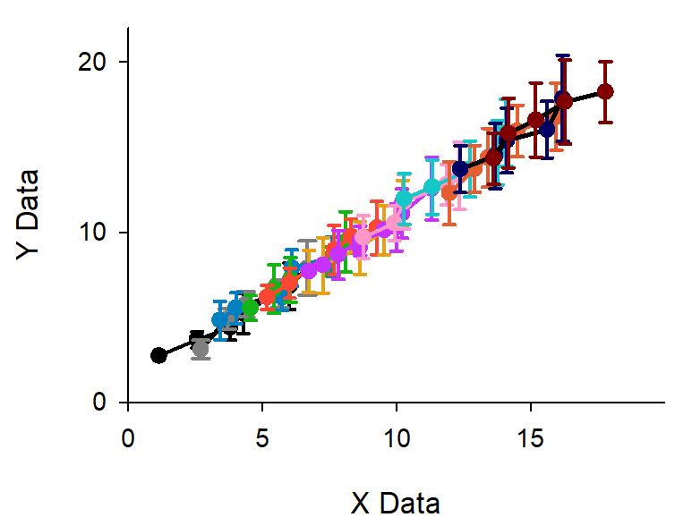
    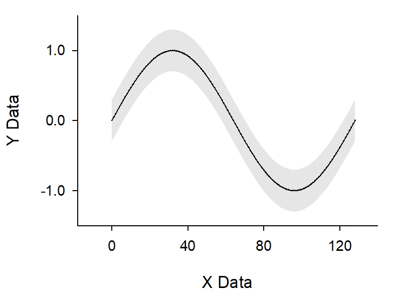
    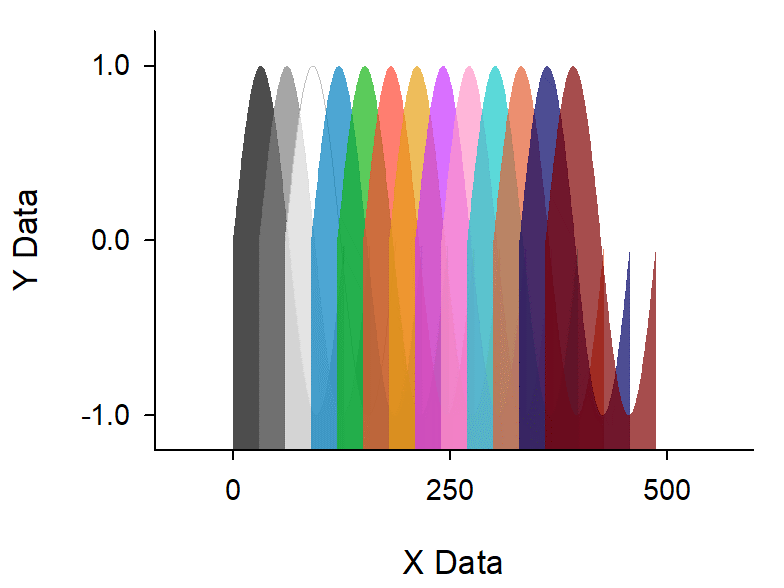
    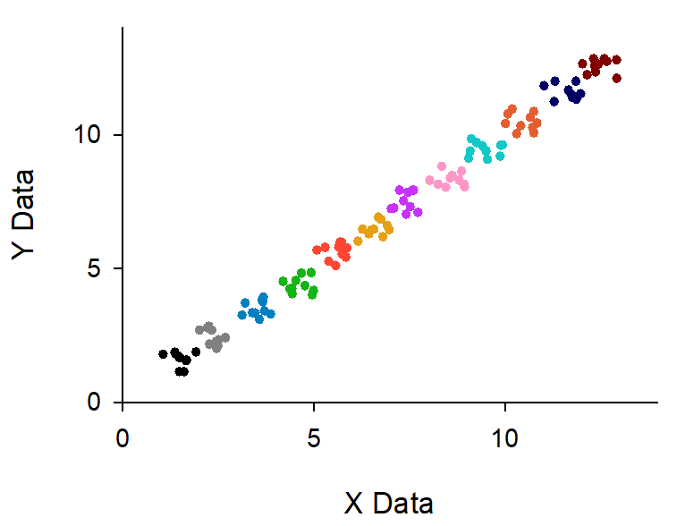
    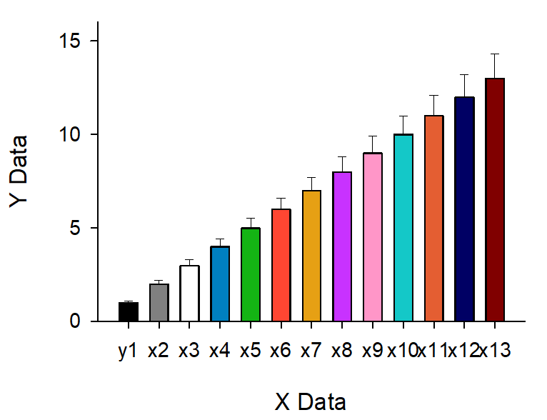
    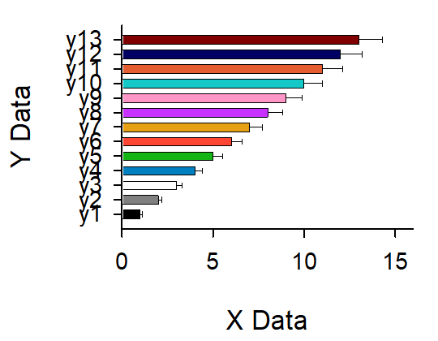
    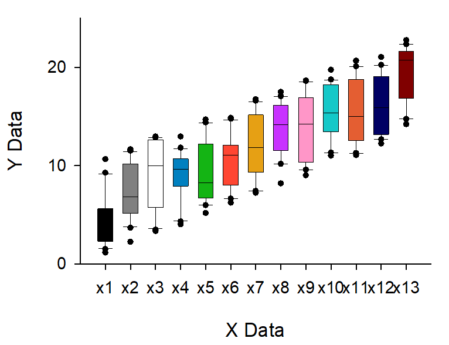
    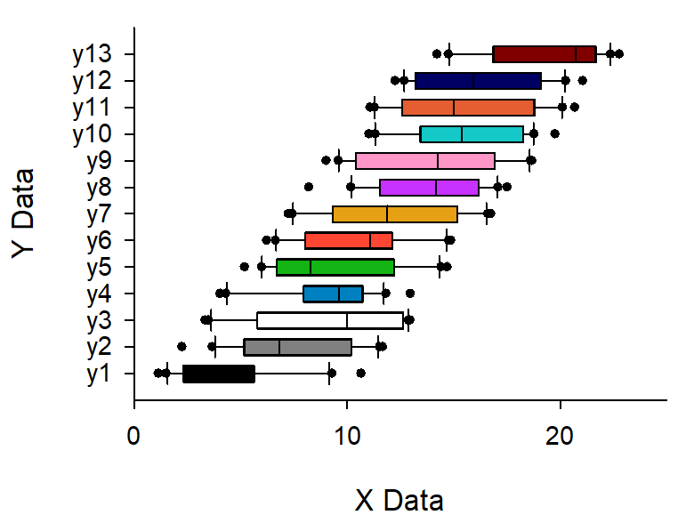
    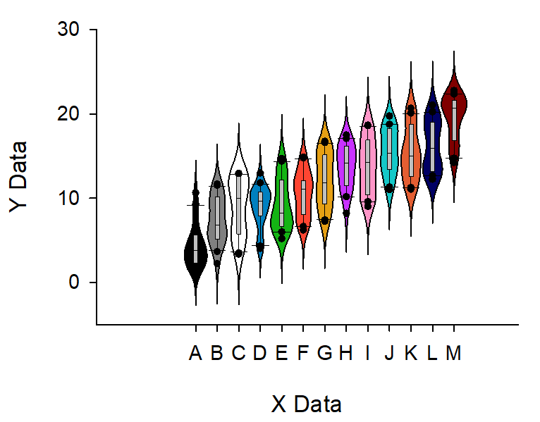
    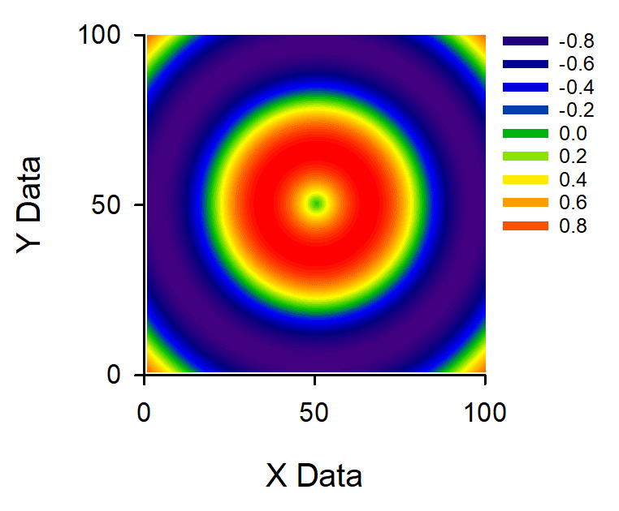
    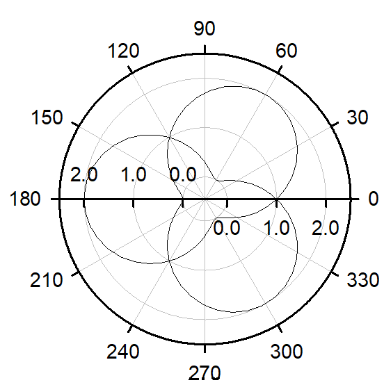
    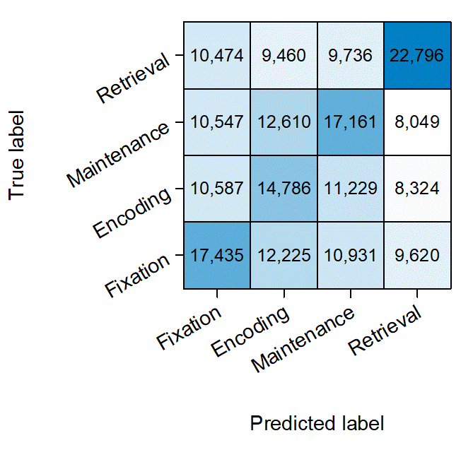

## Prerequisite

 - SigmaPlot License 
 - Windows OS

## Insallation

- SigmaPlot
  - A proprietary software for professional plotting (https://grafiti.com/sigmaplot-detail/)
  - Installation
    - [`./docs/v12_Installer/README.md`](./docs/v12_Installer/README.md)

- SigMacro
  - Series of macros for automating SigmaPlot
  - Installation
    - [`./SigMacro/README.md`](./SigMacro/README.md)

- PySigMacro
  - Python Interface for calling SigMacro
  - [Demo Movie](https://onedrive.live.com/?qt=allmyphotos&photosData=%2Fshare%2F12F1169924695EF9%213150863%3Fithint%3Dvideo%26e%3DLnoc26&sw=bypassConfig&cid=12F1169924695EF9&id=12F1169924695EF9%213150863&authkey=%21AFE1u69Zha9Sois&v=photos)
  - Installation
    - [`./PySigMacro/README.md`](./PySigMacro/README.md)

## TODO
- [ ] From Python...
  - [ ] Add Plot
  - [ ] Change Color
- [ ] As a Service

## Contact
Yusuke Watanabe (ywatanabe@alumni.u-tokyo.ac.jp)

<!-- EOF -->