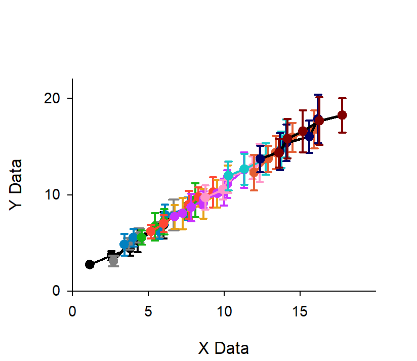
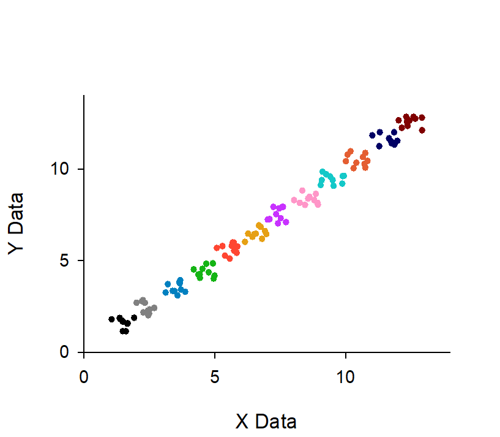
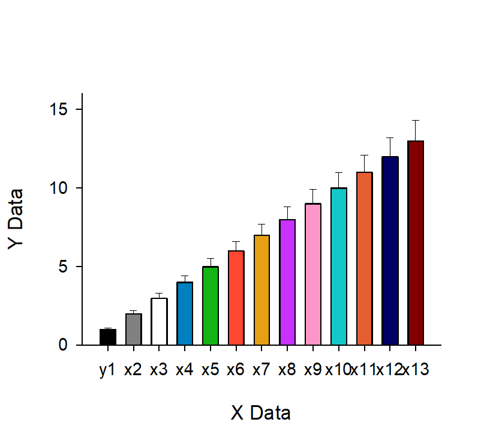
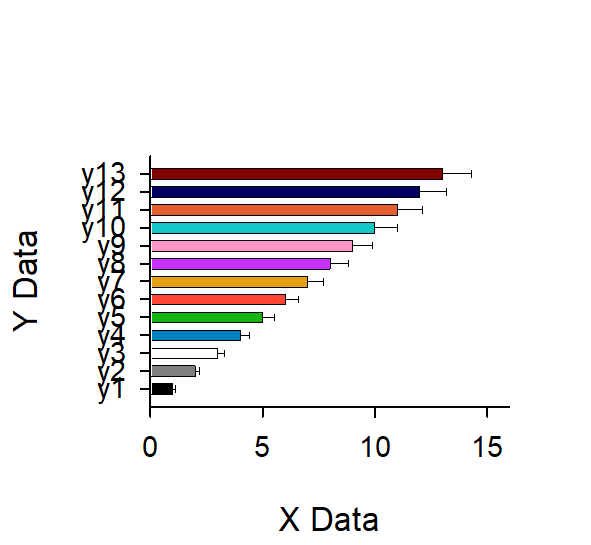
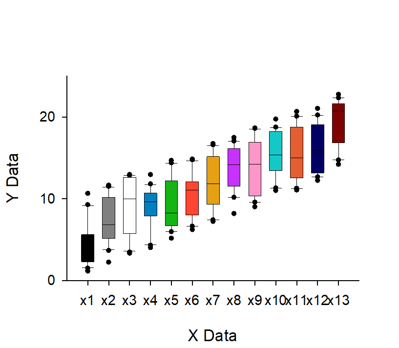
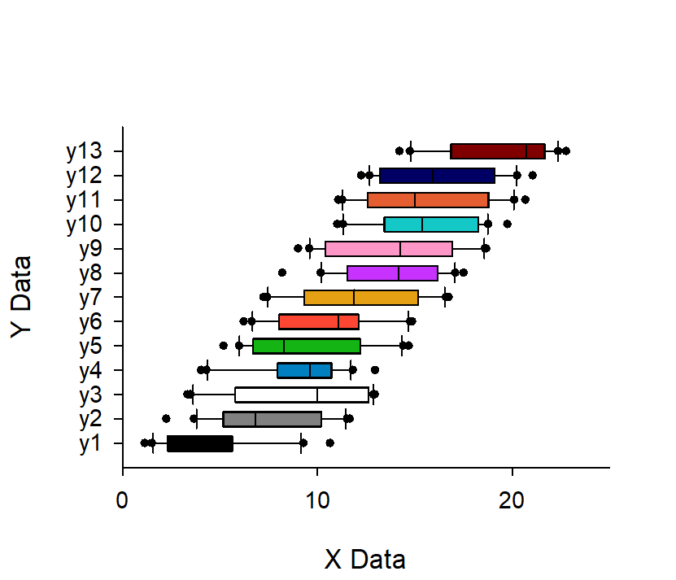

<!-- ---
!-- Timestamp: 2025-03-24 00:03:03
!-- Author: ywatanabe
!-- File: /home/ywatanabe/win/documents/SigMacro/README.md
!-- --- -->

# SigMacro

A package for automating SigmaPlot routines.


<div style="display: grid; grid-template-columns: repeat(2, 1fr); grid-gap: 10px;">
  
  
  
  
  
  
</div>


## Prerequisite

 - SigmaPlot License 
 - Windows OS

## Insallation

- SigmaPlot
  - A proprietary software for professional plotting (https://grafiti.com/sigmaplot-detail/)
  - Installation
    - [`./docs/v12_Installer/README.md`](./docs/v12_Installer/README.md)

- SigMacro
  - Series of macros for automating SigmaPlot
  - Installation
    - [`./SigMacro/README.md`](./SigMacro/README.md)

- PySigMacro
  - Python Interface for calling SigMacro
  - Installation
    - [`./PySigMacro/README.md`](./PySigMacro/README.md)

<details>
<summary>SigmaPlot Objects</summary>

``` plaintext
**Application**
└── **Notebooks** (collection)
    └── **Notebook**
        └── **NotebookItems** (collection)
            ├── **NativeWorksheetItem**
            │   ├── **DataTableNamedDataRanges** (collection)
            │   │   └── **NamedDataRange**
            │   ├── Smoother
            │   ├── PlotEquation
            │   └── **GraphWizard**
            ├── ExcelItem
            │   ├── DataTableNamedDataRanges (collection)
            │   │   └── NamedDataRange
            │   ├── Smoother
            │   ├── PlotEquation
            │   └── **GraphWizard**
            ├── FitItem
            │   └── FitResults
            ├── TransformItem
            ├── ReportItem
            ├── **MacroItem**
            ├── **NotebookItem**
            ├── **SectionItem**
            └── **GraphItem**
                └── **Pages** (collection)
                    └── **GraphObjects (Page)** (collection)
                        ├── Text
                        ├── **Line**
                        ├── **Solid**
                        ├── **GraphObject**
                        ├── Group
                        ├── Smoother
                        ├── PlotEquation
                        └── **Graph**
                            ├── **Graph Objects (Axis)** (collection)
                            │   └── **Axis**
                            ├── **Line** (collection)
                            ├── Text (collection)
                            │   └── Text
                            ├── Group (AutoLegend)
                            │   ├── Solid
                            │   └── Text
                            ├── **Graph Objects (Plots)** (collection)
                            │   └── **Plot**
                            │       ├── Symbol
                            │       ├── **Line**
                            │       ├── **Solid**
                            │       └── Text
                            ├── GraphObjects (Tuple) (collection)
                            │   └── Tuple
                            ├── Graph Objects (DropLines) (collection)
                            │   └── Line
                            └── Graph Objects (Function) (collection)
                                ├── Function (Line)
                                └── Text
```
</details>

## TODO
- [ ] Create a new graph (with graph_item.CreateWizardGraph())
- [ ] Add Plot from Python
- [ ] Change Color from Python
- [ ] X/Y Labels from Python
- [ ] Export as PDF (300 dpi) from Python
- [ ] Crop margines
- [ ] Graph Types (https://grafiti.com/sigmaplot-v16/sigmaplot-whats-new/)
  - [ ] Line + Fill
  - [ ] Violin Plot
  - [ ] Area
  - [ ] Contour
  - [ ] Confusion Matrix
  - [ ] Polar

- [ ] As a Service

## Contact
Yusuke Watanabe (ywatanabe@alumni.u-tokyo.ac.jp)

<!-- EOF -->
