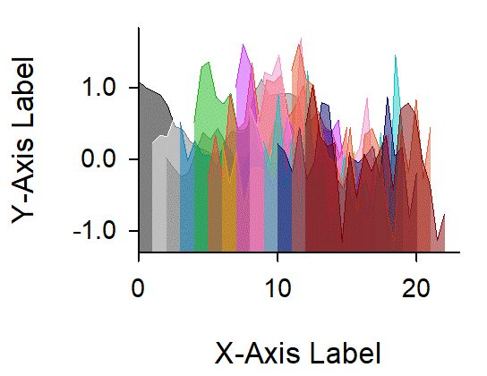
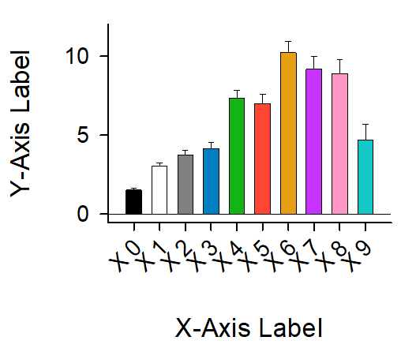
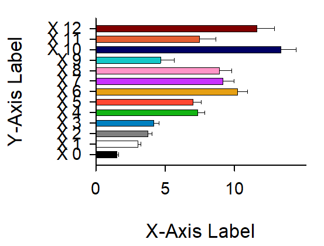
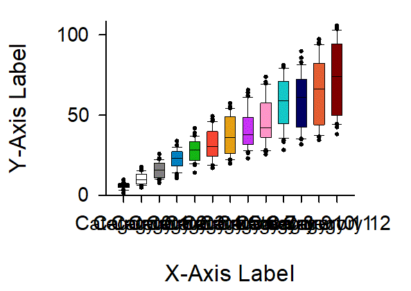
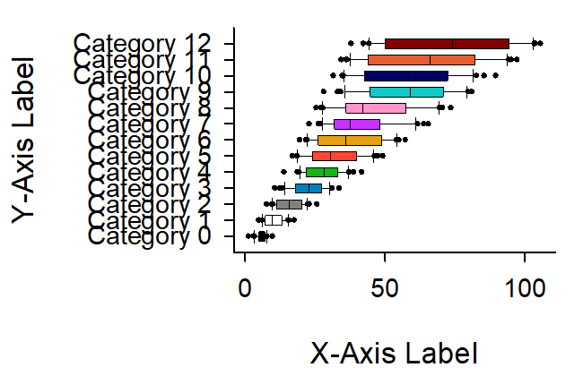
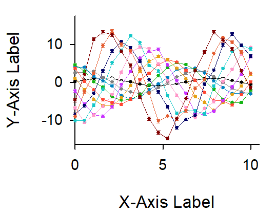
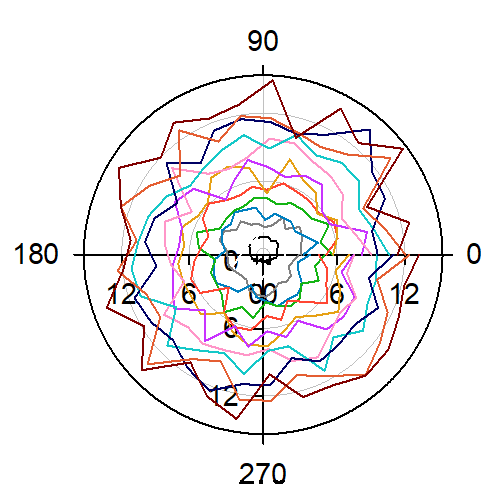
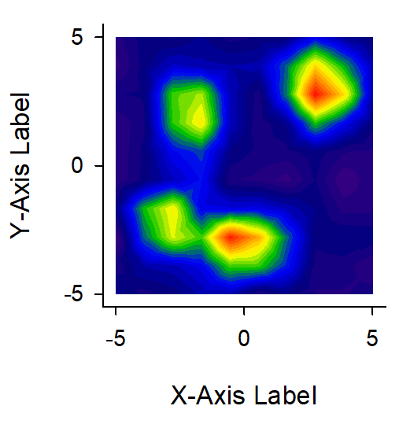
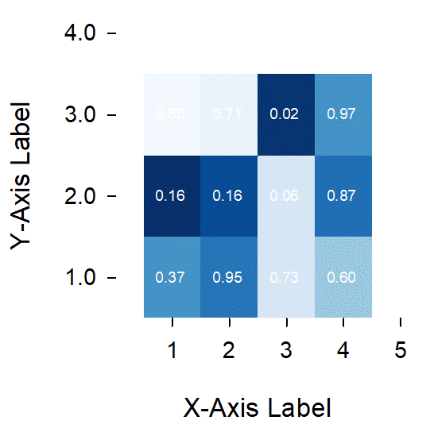
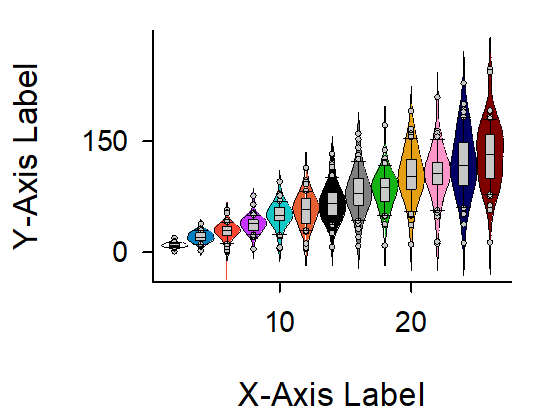

<!-- ---
!-- Timestamp: 2025-04-07 22:02:35
!-- Author: ywatanabe
!-- File: /home/ywatanabe/win/documents/SigMacro/README.md
!-- --- -->

# SigMacro

This package allows users to create publication-ready figures using [SigmaPlot](https://grafiti.com/sigmaplot-v16/) from Python, in a similar manner to matplotlib.

## In SigmaPlot:
1. Preparing template SigmaPlot files with embedded macros for:
   - Reading graph parameters
   - Plotting data

## From Python:
1. Sending plotting data and graph visualization parameters to SigmaPlot
2. Calling SigmaPlot macros
3. Saving figures & cropping margins


<div style="display: grid; grid-template-columns: repeat(2, 1fr); grid-gap: 10px;">
    
    
    
    
    
    
    
    
    
    
    <!-- Not implemented yet -->
    
    
    
</div>

## TODO
- [ ] Jitter
  - [ ] 

- [ ] Filled Line
  - [ ] Area (upper)
  - [ ] Line
  - [ ] Area (lower)

- [ ] Violin
  - [ ] Calculating kde
  - [ ] kde left - right (multiple line plots)
  - [ ] Box plot

- [ ] Violinh
  - [ ] like Violin


## Prerequisite

 - SigmaPlot License 
 - Windows OS

## Insallation

- SigmaPlot
  - A proprietary software for professional plotting (https://grafiti.com/sigmaplot-detail/)
  - Installation
    - [`./docs/v12_Installer/README.md`](./docs/v12_Installer/README.md)

- SigMacro
  - Series of macros for automating SigmaPlot
  - Installation
    - [`./SigMacro/README.md`](./SigMacro/README.md)

- PySigMacro
  - Python Interface for calling SigMacro
  - [Demo Movie](https://onedrive.live.com/?qt=allmyphotos&photosData=%2Fshare%2F12F1169924695EF9%213150863%3Fithint%3Dvideo%26e%3DLnoc26&sw=bypassConfig&cid=12F1169924695EF9&id=12F1169924695EF9%213150863&authkey=%21AFE1u69Zha9Sois&v=photos)
  - Installation
    - [`./PySigMacro/README.md`](./PySigMacro/README.md)

## Key Directories

``` bash
./PySigMacro/examples
./PySigMacro/src/pysigmacro/data/temp
```

## Usage

``` powershell
python.exe ./PySigMacro/examples/create_demo_data.py
```

## TODO
- [ ] As a Service

## Contact
Yusuke Watanabe (ywatanabe@alumni.u-tokyo.ac.jp)

<!-- EOF -->