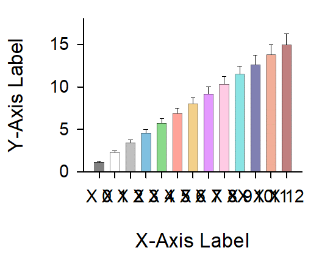
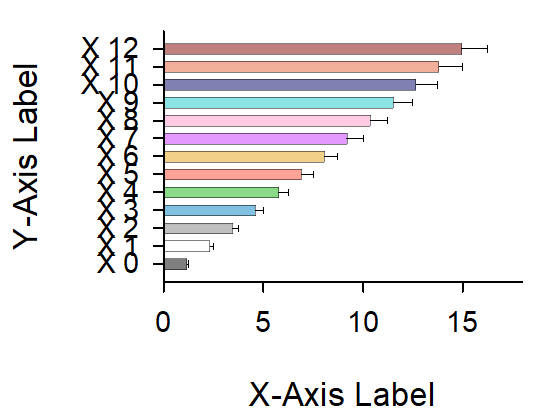
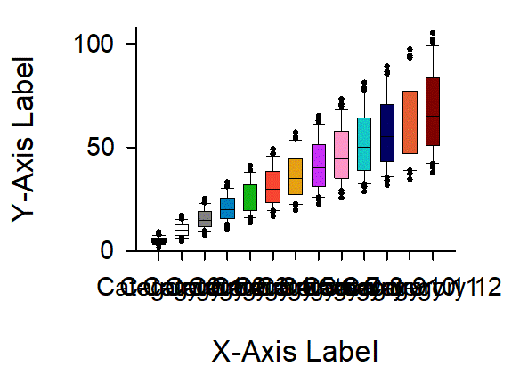
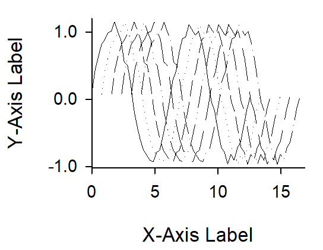

<!-- ---
!-- Timestamp: 2025-04-09 02:24:48
!-- Author: ywatanabe
!-- File: /home/ywatanabe/win/documents/SigMacro/README.md
!-- --- -->

# SigMacro

This package allows users to create publication-ready figures using [SigmaPlot](https://grafiti.com/sigmaplot-v16/) from Python, in a similar manner to matplotlib.

## In SigmaPlot:
1. Preparing template SigmaPlot files with embedded macros for:
   - Reading graph parameters
   - Plotting data

## From Python:
1. Sending plotting data and graph visualization parameters to SigmaPlot
2. Calling SigmaPlot macros
3. Saving figures & cropping margins


<div style="display: grid; grid-template-columns: repeat(2, 1fr); grid-gap: 10px;">
    
    
    
    
    
    
        
            
    
    
    
    
    <!-- Not implemented yet -->
    
    
    
</div>

## Key files
- ['./vba/ALL-IN-ONE-MACRO.vba'](./vba/ALL-IN-ONE-MACRO.vba)
  - All-in-one macro for all types of available plot types
    - (This is because calling macro from another macro seems not allowed)
- ['./templates/jnb/template.JNB'](./templates/jnb/template.JNB)
  - The template file for all types of plot. This file contains the all-in-one macro.
- ['./PySigMacro/examples/demo.py'](./PySigMacro/examples/demo.py)
  - Demo Python code to plot figures using SigmaPlot
- ['./templates/gif/*.gif'](./templates/gif/*.gif)
  - The produced figures by running the demo.py script.

## Prerequisite

 - SigmaPlot License 
 - Windows OS

## Insallation

- ['SigmaPlot'](https://grafiti.com/sigmaplot-detail/)
  <!-- - A proprietary software for professional plotting (https://grafiti.com/sigmaplot-detail/)
   !-- - Installation
   !--   - [`./docs/v12_Installer/README.md`](./docs/v12_Installer/README.md) -->

- SigMacro
  - Series of macros for automating SigmaPlot
  - Installation
    - [`./SigMacro/README.md`](./SigMacro/README.md)

- PySigMacro
  - Python Interface for calling SigMacro
  - [Demo Movie](https://onedrive.live.com/?qt=allmyphotos&photosData=%2Fshare%2F12F1169924695EF9%213150863%3Fithint%3Dvideo%26e%3DLnoc26&sw=bypassConfig&cid=12F1169924695EF9&id=12F1169924695EF9%213150863&authkey=%21AFE1u69Zha9Sois&v=photos)
  - Installation
    - [`./PySigMacro/README.md`](./PySigMacro/README.md)

## Usage

``` powershell
python.exe ./PySigMacro/examples/demo.py
```

## TODO
- [ ] Histgram (= binning + bar)

- [ ] Jitter (= area + line + area)

- [ ] Filled Line (= area + line + area)

- [ ] Violin/Violinh (= kde calculation + multiple lines + boxplot (+ jitter))
  - [ ] ./PySigMacro/src/pysigmacro/violin/_prepare_violin_data.py

- [ ] Simple interface like below

  ``` python
  import pysigmacro as psm
  import pandas as pd

  df = pd.DataFrame(...)

  plotter = psm.Plotter()
  plotter.add("area", df["x", "y"])
  plotter.add("line", df["x", "y", "yerr"])
  plotter.add("box", df["x"])
  plotter.add("scatter", df["x", "y"])
  # plotter.add("boxh", df["y"])
  ...

    ```

## Contact
Yusuke Watanabe (ywatanabe@alumni.u-tokyo.ac.jp)

<!-- EOF -->